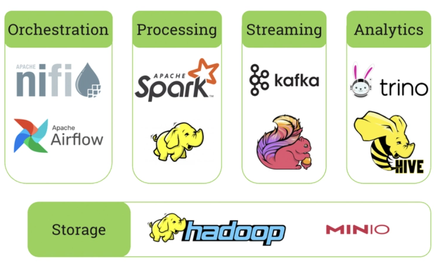

# Big Data Ecosystem with Docker Compose

This guide provides a comprehensive checklist and instructions for setting up a big data ecosystem using Docker Compose. The stack includes the following components:

- **Nifi** for data ingestion
- **Spark** for compute
- **Kafka + Flink** for streaming
- **Trino + Hive** for RDBMS
- **Hadoop / Minio** for datastore

---

## Full-Stack Data Platform

Below is a visual representation of the full-stack data platform:


---

## Architecture

The architecture of the big data platform is illustrated below:



---

## Full-Stack Checklist

### 1. General Prerequisites

- [x] Install Docker and Docker Compose.

- [x] Allocate sufficient resources (CPU, RAM, and Disk) for Docker.

- [x] Ensure ports required by the services are available.

- [x] Clone this repository and navigate to the `docker-bigdata-compose` directory.

### 2. Nifi (Data Ingestion)

- [x] Define Nifi flows for data ingestion.

- [x] Configure Nifi processors for data sources and sinks.

- [x] Expose Nifi UI on a specific port (e.g., `http://localhost:8080`).

- [ ] Test data ingestion pipelines.

### 3. Spark (Compute)

- [ ] Set up a Spark master and worker nodes.

- [ ] Configure Spark for distributed computing.

- [ ] Verify Spark UI (e.g., `http://localhost:8081`).

- [ ] Run a sample Spark job to validate the setup.

### 4. Kafka + Flink (Streaming)

- [ ] Deploy Kafka brokers and Zookeeper.

- [ ] Create Kafka topics for streaming data.

- [ ] Set up Flink for stream processing.

- [ ] Connect Flink to Kafka topics.

- [ ] Test a sample Flink job for streaming analytics.

### 5. Trino + Hive (RDBMS)

- [ ] Deploy Hive Metastore and configure it with a database (e.g., MySQL/PostgreSQL).

- [ ] Set up Trino for querying data.

- [ ] Connect Trino to Hive Metastore.

- [ ] Test SQL queries on the data.

### 6. Hadoop / Minio (Datastore)

- [ ] Deploy Hadoop HDFS for distributed storage.

- [ ] Alternatively, set up Minio for object storage.

- [ ] Configure storage paths and permissions.

- [ ] Test data storage and retrieval.

---

## Deployment Guide

### Step 1: Start All Services

Run the following commands to start each service:

```bash
docker compose up -d minio
docker compose up -d namenode datanode nodemanager resourcemanager historyserver
docker compose up -d hive-metastore hive-server
docker compose up -d spark-master spark-worker
docker compose up -d trino
docker compose up -d nessie
docker compose up -d airflow-db airflow
docker compose up -d jobmanager taskmanager
docker compose up -d kafka schema-registry postgresql conduktor-console conduktor-monitoring
docker compose up -d nifi-zookeeper nifi
```

### Step 2: Verify Services

- Access Nifi: `http://localhost:8080`

- Access Spark UI: `http://localhost:8081`

- Access Kafka: Use Kafka CLI tools or a UI like Kafdrop.

- Access Flink: `http://localhost:8082`

- Access Trino: `http://localhost:8083`

- Access Hadoop/Minio: `http://localhost:9000` (Minio) or HDFS CLI.

### Step 3: Test the Ecosystem

- Ingest data using Nifi.

- Process data with Spark.

- Stream data using Kafka and Flink.

- Query data with Trino and Hive.

- Store and retrieve data using Hadoop/Minio.

---

## Notes

- Modify the `docker-compose.yaml` file to customize configurations.

- Ensure proper networking between services.

- Monitor logs for troubleshooting: `docker-compose logs -f`.

---

## Credits

This setup is inspired by the repository: [bigdata-ecosystem-sandbox](https://github.com/amhhaggag/bigdata-ecosystem-sandbox.git)

Clone the repository for reference:

```bash
git clone https://github.com/amhhaggag/bigdata-ecosystem-sandbox.git
```

---

Happy Big Data Engineering!